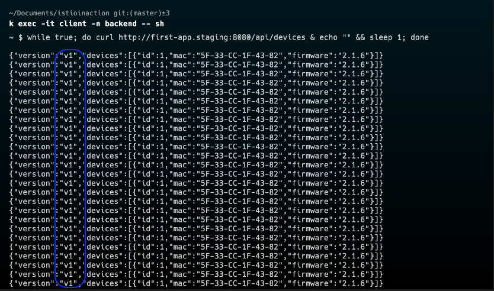

# istio-project

The project centers around the implementation of Istio to enhance the advantages of a microservices architecture.

For cert-maneger to work correctly `--set meshConfig.ingressSelector=gateway --set meshConfig.ingressService=istio-gateway` to be able to resolve http01 challenge from lets-encrypt

# Setup EKS Cluster

# Install Istio

# Install istiod
Installation of Istiod consist of combination of pilot, citadel and gallery.
Ensure to update meshconfig in the istiod.yaml to allow easy installation of cert-manager so as to be able to resolve http01 challenge from lets encrypt

Confirm if Istiod pod is running

Now that Istio is deployed properly we can start managing traffic in the cluster using the istio control plane.

We need to ensure istio inject sidecars to all pods which enhance and control communication betweeen micro services. This injection allows Istio to provide features such as traffic management, security, observability, and policy enforcement consistently across all microservices in the cluster

Ensuring istio is deployed in all pod in a namespace, in order for istio to manage traffic, each service must have an istio sidecar

We have two deployments to simulate canary with each one having label version "v1" and "v2"  respectively and label "app:first-app", which is used by service as the label selector and this will randomly route traffic between v1 and v2

  You, 2 days ago l.png>)

To handle managing and shifting traffic, we make use of some istio custom resources

# DestinationRule: 
Let you define the how you want to route your traffic using subsets and specifying appropriate labels and the service 

.png>)

# Virtualservice:
Lets you define how you want to route traffic to different versions using http or https

The screenshot above just show all traffic will go the v1 version. Lets run the app-01 folder to deploy the application and explore how the traffic is covered. To test, we we used a client inside kubernetes which also has a sidecar 

Lets exec into the client and use curl to hit our first app service in the staging namespace. From the screenshot, we can see that we are only connecting the v1 application.

