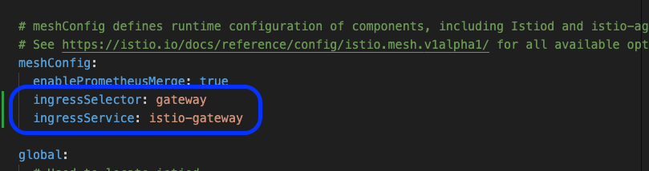

# istio-project
The Project is focus on implementing different use-case for istio

For cert-maneger to work correctly `--set meshConfig.ingressSelector=gateway --set meshConfig.ingressService=istio-gateway` to be able to resolve http01 challenge from lets-encrypt

# Setup EKS Cluster

# Install Istio

# Install istiod

Ensure to update meshconfig in the istiod.yaml to allow easy installation of cert-manager so as to be able to resolve http01 challenge from lets encrypt

